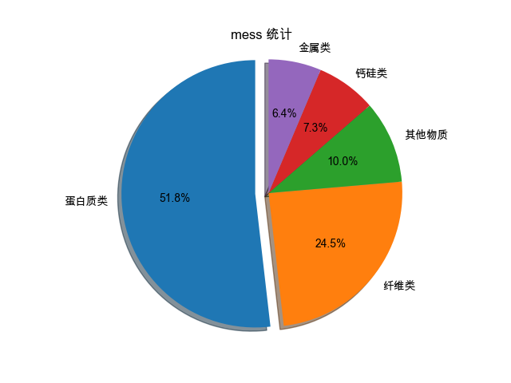
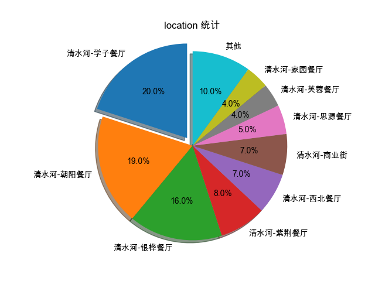

# UESTC-CanteenTreasureHunt
通过自动化爬虫技术，我们收集学生在河畔论坛上关于食堂异物的帖子和评论，然后利用自然语言处理技术分析这些数据，提取事件发生的地点、异物类型以及后续处理情况。最终，我们将这些信息以直观的图表形式展示出来，帮助学校管理层和学生更好地了解食堂的食品安全状况。

## 项目结果展示

### 异物类型统计


### 事件地点分布统计


## 项目结构

```
project/
│
├── run.py                 # 主执行脚本，负责解析参数并调用其他模块
├── run.sh                 # Shell 脚本，用于快速启动项目
├── utils/                 # 工具目录，包含辅助函数和模块
│   ├── analyse.py         # 分析模块，负责对收集的数据进行统计分析
│   ├── crawler.py         # 爬虫模块，负责从论坛抓取帖子和评论
│   └── generate.py        # 生成模块，负责与API交互生成分析结果
├── config/                # 配置文件目录
│   ├── cookie.txt         # 用于爬虫的cookie文件
│   └── config.yaml        # 配置文件，包含API信息等
├── log/                   # 日志文件目录
├── output/                # 输出文件目录
│   ├── page_link.json     # 保存帖子链接的JSON文件
│   ├── page_detail.jsonl  # 保存帖子详细信息的JSON Lines文件
│   └── data.jsonl         # 保存分析结果的JSON Lines文件
├── assets/                # 结果展示目录
│   ├── mess统计.png       # 异物类型统计图
│   └── location统计.png   # 事件地点分布统计图
└── README.md              # 项目说明文件
```

## 环境要求

### Python 依赖包
```bash
pip install requests beautifulsoup4 tqdm matplotlib openai pyyaml jsonlines
```

### 系统要求
- Python 3.7+
- 网络连接（用于爬取论坛数据和调用API）

## 快速开始

### 1. 安装依赖
```bash
# 安装所需的Python包
pip install requests beautifulsoup4 tqdm matplotlib openai pyyaml jsonlines
```

### 2. 配置环境
- **Cookie配置**：将 `config/cookie.txt` 替换为有效的论坛cookie
- **API配置**：根据需要修改 `config/config.yaml` 中的API配置

### 3. 运行项目

#### 方法一：使用Shell脚本（推荐）
```bash
# 给脚本执行权限
chmod +x run.sh

# 运行完整流程
./run.sh
```

#### 方法二：直接使用Python脚本
```bash
# 运行完整流程（爬虫 + 生成 + 分析）
python run.py

# 或者分步执行
python run.py --run crawler
python run.py --run generate
python run.py --run analyse
```

## 详细使用方法

### 命令行参数说明

`run.py` 支持以下命令行参数：

| 参数 | 类型 | 默认值 | 说明 |
|------|------|--------|------|
| `--cookie_file` | str | `config/cookie.txt` | Cookie文件路径 |
| `--page_link_file` | str | `output/page_link.json` | 帖子链接保存文件 |
| `--page_detail_file` | str | `output/page_detail.jsonl` | 帖子详情保存文件 |
| `--output_path` | str | `output/data.jsonl` | 分析结果输出文件 |
| `--config_path` | str | `config/config.yaml` | 配置文件路径 |
| `--log_path` | str | `log` | 日志文件目录 |
| `--run` | list | `['crawler', 'generate', 'analyse']` | 要执行的模块 |

### 使用示例

#### 1. 完整流程执行
```bash
# 执行爬虫、生成和分析三个模块
python run.py
```

#### 2. 分步执行
```bash
# 只执行爬虫模块
python run.py --run crawler

# 只执行生成模块
python run.py --run generate

# 只执行分析模块
python run.py --run analyse

# 执行爬虫和生成，跳过分析
python run.py --run crawler generate
```

#### 3. 自定义文件路径
```bash
# 使用自定义的cookie文件
python run.py --cookie_file /path/to/your/cookie.txt

# 指定输出目录
python run.py --output_path /path/to/output/results.jsonl

# 指定配置文件
python run.py --config_path /path/to/config.yaml
```

#### 4. 重新分析已有数据
```bash
# 如果已有爬取的数据，只进行分析
python run.py --run analyse
```

### 配置文件说明

#### config.yaml 示例
```yaml
# API配置
api:
  base_url: "https://api.openai.com/v1"
  api_key: "your-api-key-here"
  model: "gpt-3.5-turbo"
  max_tokens: 2000
  temperature: 0.7

# 爬虫配置
crawler:
  base_url: "https://bbs.uestc.edu.cn"
  search_keywords: ["食堂", "异物", "虫子", "头发"]
  max_pages: 50
  delay: 1  # 请求间隔（秒）
```

## 功能模块说明

### 1. 爬虫模块 (crawler)
- **功能**：自动从电子科技大学论坛抓取食堂异物相关的帖子和评论
- **输出**：
  - `page_link.json`：帖子链接列表
  - `page_detail.jsonl`：帖子详细内容

### 2. 生成模块 (generate)
- **功能**：使用OpenAI API对帖子内容进行分析，提取结构化信息
- **处理内容**：
  - 事件发生地点
  - 异物类型
  - 后续处理情况
  - 事件时间
- **输出**：`data.jsonl`：包含分析结果的JSON Lines文件

### 3. 分析模块 (analyse)
- **功能**：对收集的数据进行统计分析
- **分析内容**：
  - 异物类型分布统计
  - 事件地点分布统计
  - 后续处理情况分析
  - 时间趋势分析
- **输出**：生成可视化图表和统计报告

## 输出文件说明

### page_link.json
```json
{
  "links": [
    "https://bbs.uestc.edu.cn/thread-12345-1-1.html",
    "https://bbs.uestc.edu.cn/thread-67890-1-1.html"
  ]
}
```

### page_detail.jsonl
```json
{
  "title": "食堂发现异物",
  "content": "今天在食堂吃饭时发现...",
  "author": "用户名",
  "publish_time": "2024-01-01 12:00:00",
  "is_replay": false
}
```

### data.jsonl
```json
{
  "is_replay": false,
  "index": 0,
  "result": {
    "location": "第一食堂",
    "foreign_object": "头发",
    "handling": "已更换新餐品",
    "time": "2024-01-01",
    "severity": "轻微"
  }
}
```

## 日志和调试

### 日志文件
- 位置：`log/` 目录
- 命名格式：`log_YYYY-MM-DD-HH-MM-SS.txt`
- 内容：包含API调用记录、错误信息等

### 常见问题排查
1. **Cookie无效**：检查 `config/cookie.txt` 文件是否有效
2. **API调用失败**：检查 `config/config.yaml` 中的API配置
3. **网络连接问题**：确保网络连接正常，可以访问论坛和API

## 注意事项

1. **Cookie有效期**：论坛cookie通常有时效性，需要定期更新
2. **API限制**：注意OpenAI API的调用频率和费用限制
3. **数据隐私**：请遵守相关法律法规和论坛使用条款
4. **备份数据**：建议定期备份重要的输出文件

## 贡献

欢迎对项目进行贡献，包括但不限于：
- 增加新的数据源
- 改进分析算法
- 修复已知问题
- 优化用户界面
- 添加新的可视化功能

### 贡献方式
1. Fork 本项目
2. 创建特性分支 (`git checkout -b feature/AmazingFeature`)
3. 提交更改 (`git commit -m 'Add some AmazingFeature'`)
4. 推送到分支 (`git push origin feature/AmazingFeature`)
5. 开启 Pull Request

## 许可证

本项目采用 MIT 许可证 - 查看 [LICENSE](LICENSE) 文件了解详情。

## 联系方式

如有问题或建议，请通过以下方式联系：
- 提交 Issue
- 发送邮件至项目维护者